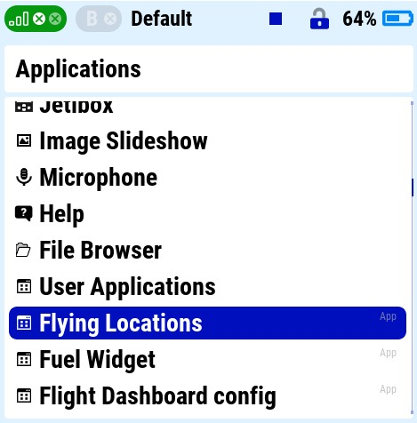
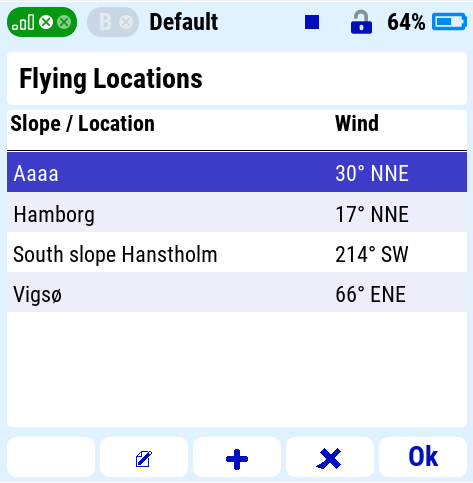
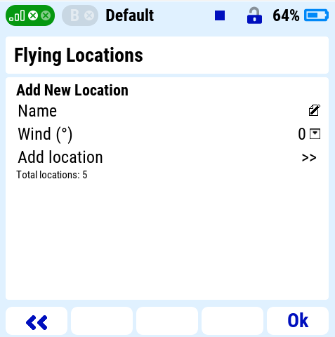
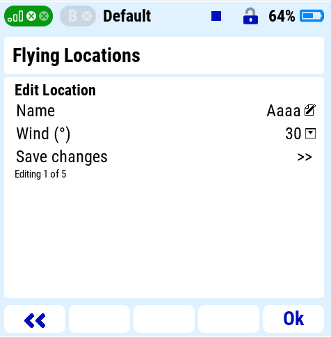
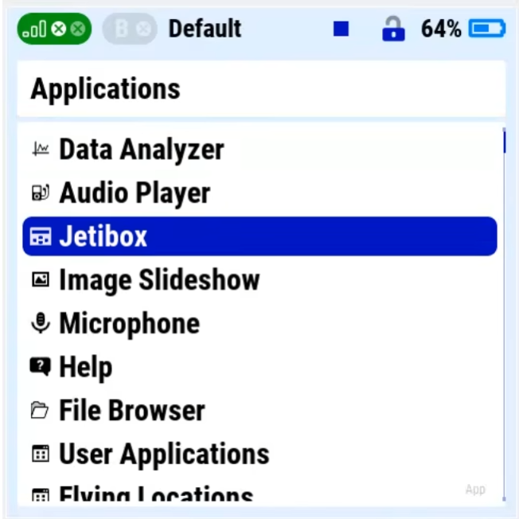

# flyloc.lua
Small app that keeps a list of slopes and their wind directions, perfect to use with the [F3F Tool](https://github.com/frank-sc).

## Description
Flying Locations — Jeti DC/DS transmitter app\
Should be compatible with all Jeti transmitters on firmware 4.22+\
\
File layout on the transmitter:\
   Apps/flyloc.lua\
   Apps/flyloc/flyloc.jsn\
\
Version: 1.2\
\
flyloc.jsn can be edited on your computer before uploading to the transmitter. It is in a standard json format.
A compiled .lc version is also included if needed but most should be able to run the .lua file.

## Installation

1. Copy `flyloc.lua` to `Apps/` folder on the transmitter
2. Create the folder `Apps/flyloc/`
3. Copy `flyloc.jsn` to `Apps/flyloc/`
4. On the transmitter go to Applications → User Applications → + to activate

If you have another version of the F3F Tool or have made changes to the file structure you can edit the location on line 24.\
_local F3F_FILE  = "Apps/f3fTool-21/slopeData.jsn"_

## Screenshots

After you add the application under User Applications it appears under Applications.\
\

**Main screen is a list of slopes, that you can add, edit or delete from.**
* F1 - Send slope to F3F Tool
* F2 - Edit selected slope
* F3 - Add new slope
* F4 - Delete selected slope

Add new slope.\
\

Edit an existing slope.\
\

\

## Video

## Files

### flyloc.lua
Uncompiled code, human readable can be run on the transmitter but takes more memory space.

### flyloc.lc
Compiled code, takes less space in the transmitters memory.

## Project support
If you found this helpful and would like to donate to my coffee fund, you can do so here [https://paypal.me/sverrirgu](https://paypal.me/sverrirgu).
